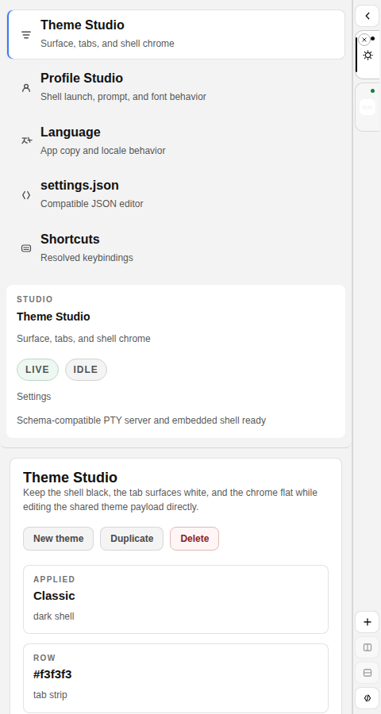

<div align="center">

# webpty

**공유 프로필/테마 설정을 사용하는 Rust 기반 브라우저 터미널 셸**

[English README](./README.md)

</div>

`webpty`는 셸이 화면의 주인공이 되도록 설계되어 있습니다.
터미널은 검은색으로 화면 대부분을 차지하고, 우측에는 얇은 세션 레일이
붙어 있으며, 설정 워크스페이스는 별도 탭으로 그 레일에서 바로 열립니다. 실행 경로는 Rust 단일
바이너리이고 `webpty up` 한 번으로 UI와 PTY 런타임을 함께 올립니다.

프로필, 테마, 색상표, 액션, 기본값은 공유 가능한 데스크톱 터미널용
`settings.json`의 지원 subset을 사용합니다. 저장 시 알 수 없는 키는 그대로
보존되고, 디스크에서 읽을 때는 JSONC 스타일 주석과 trailing comma도
허용합니다.

## 미리보기




## 현재 상태

구현됨:

- Rust/Axum 서버 기반 PTY 세션 생성과 WebSocket 스트리밍
- Rust 바이너리에서 직접 서빙되는 임베디드 프로덕션 UI
- `webpty up` CLI 진입점
- `webpty up --funnel` 외부 접속용 Tailscale Funnel
- `webpty up --funnel`에서 자동 `tailscale up` 부트스트랩과 로그인 URL 안내
- 상단 툴바 없이 검은 터미널 스테이지가 중심인 레이아웃
- show/hide 가능한 우측 세션 레일
- 더 조밀한 Windows 11 스타일 레일 밀도, 흰색 플랫 탭, 별도 설정 워크스페이스 탭
- `themes[]`, `theme`, 프레임 색상, 셸 크롬을 바로 다루는 Theme Studio
- `profiles.list[]`, 기본 프로필, 프롬프트, 폰트, 셸 필드를 바로 다루는 Profile Studio
- 레지스트리 기반 UI 언어 선택을 다루는 `webpty.language` 기반 Language 섹션
- Theme Studio / Profile Studio 초안 동기화에서 재귀 렌더 루프 콘솔 오류가 나지 않도록 한 안정화
- profile/theme 항목 생성·복제·삭제용 인앱 UI
- 탭, 프레임, 셸, 커서, 선택 영역 색상을 위한 인앱 color picker
- Theme Studio / Profile Studio의 색상 값 입력창이 잘리지 않도록 전체 값을 그대로 보여주는 편집 UI
- `accent`, `terminalBackground` 같은 공용 테마 토큰을 바로 넣는 shortcut chip
- 프롬프트, 탭 강조색, 셸 색을 즉시 확인할 수 있는 프로필 미리보기
- `{cwd}`, `{user}`, `{host}`, `{profile}`, `{symbol}` 토큰을 쓰는 선택적 `webpty.prompt` 템플릿
- 숨김 프로필이 실수로 시작 프로필이 되지 않도록 하는 startup-profile guard
- schema 호환 `settings.json` 로드, 정규화, 저장, 미지원 키 round-trip 보존
- 디스크 기준 JSONC 스타일 설정 파일 로딩
- 앱 내 `settings.json` 패널에서 JSONC 스타일 편집 지원
- `{ "command": { "action": "newTab" } }` 같은 문자열/객체형 액션 바인딩 지원
- Profile Studio와 Theme Studio 미리보기에서 런타임과 같은 프로필별 프롬프트 규칙 반영
- Theme/Profile Studio 프롬프트 미리보기에서 템플릿의 공백을 그대로 보존
- 프롬프트 템플릿의 `{profile}` 토큰이 런타임 셸과 같은 sanitize 규칙으로 미리보기됨
- 비Windows 셸 실행과 fallback 모두에서 `bash-5.2$` 대신 프로필별 문구가 드러나는 프롬프트
- 기본 zsh 호스트 셸도 clean interactive 경로로 실행되어 macOS 기본 셸 환경에서 프로필 프롬프트가 바로 덮이지 않음
- 첫 실행 시 생성되는 기본 설정이 실행 OS를 따라가도록 한 host-scoped profile/settings 생성
- macOS의 `~/Library/Application Support/webpty/settings.json`을 포함한 host-native 설정 경로
- Runtime host metadata를 이용해 Profile Studio의 command/start directory 힌트가 실행 OS에 맞춰짐
- 사용자 전역 설정이 기본 우선순위를 가지며, 레포 샘플 설정은 `--settings`로만 opt-in
- bracketed-paste 같은 제어 시퀀스가 요약 라인에 새지 않도록 하는 session preview sanitizing
- `padding`, 명시적 `lineHeight`, `window.useMica`가 실제 뷰포트와 셸 크롬에 반영됨
- 반복 fit 패스를 통해 좁은 폭과 모바일에서도 xterm 행이 화면 밖으로 밀려나지 않음
- 파일 경로가 세션 작업 디렉터리가 되지 않도록 하는 stricter cwd 검증
- 시작/종료 시 Funnel 정리 경로와 capability 판별 보강
- 활성 탭 안에서 수직/수평 split 생성
- 떠다니는 배지 없이 더 절제된 split separator와 active pane framing
- PTY 입력, 리사이즈, 출력 스트림 처리
- 브라우저에서 접근 가능한 프로필 아이콘 소스를 레일과 설정 워크스페이스에 렌더링
- 프런트 빌드 후 Rust 임베디드 UI가 새 자산을 다시 포함하도록 하는 재빌드 추적
- 안전한 collapsed bounds, 더 얇아진 밀도, 더 넓은 텍스트 overflow 보호를 가진 icon-first 우측 레일
- `npm run docs:shots`로 재현 가능한 문서 스크린샷 갱신
- 레포 샘플 설정 기준으로 다시 캡처한 최신 문서 스크린샷

알려진 공백:

- 더 깊은 pane graph, 드래그 재배치, 영속 pane 레이아웃
- 탭 드래그 정렬
- 현재 탭/설정 subset을 넘는 더 넓은 action object 지원
- 모든 프로필 아이콘 URI 형식에 대한 완전한 호스트 자산 파리티
- 앱 재시작 후 세션 복원

## 빠른 시작

### 요구사항

- Rust 1.94+
- Node.js 24+ / npm 11+는 프런트 번들을 다시 빌드하거나 UI를 개발할 때만 필요

### 글로벌 설치

```bash
cargo install --git https://github.com/smturtle2/webpty --bin webpty --locked
```

설치 뒤 `webpty`가 보이지 않으면 Cargo bin 디렉터리
(`$HOME/.cargo/bin`)를 `PATH`에 추가하세요.

로컬 체크아웃 설치:

```bash
cargo install --path apps/server --bin webpty --locked
```

### 실행

```bash
webpty up
```

기본 로컬 주소는 `http://127.0.0.1:3001`입니다.

레포 샘플 설정으로 실행:

```bash
webpty up --settings ./config/webpty.settings.json
```

`./config/webpty.settings.json`은 스크린샷과 수동 QA를 위한 고정 데모
카탈로그입니다. 실제 설치 후 첫 기본값은 여전히 실행 환경을 따릅니다.

### 외부 접속

```bash
webpty up --funnel
```

`--funnel`은 로컬 `tailscale` CLI를 이용해 내장 웹 UI를 외부에 공개합니다.
로컬 클라이언트가 오프라인이면 `webpty`가 먼저 `tailscale up`을 자동으로
시도한 뒤 Funnel을 붙입니다. 헤드리스 환경에서는
`WEBPTY_TAILSCALE_AUTH_KEY`, `TS_AUTHKEY`, `TS_AUTH_KEY`도 사용할 수 있습니다.
여전히 대화형 로그인이 필요하면 `webpty`가 Tailscale 로그인 URL을 출력하고
정상적으로 종료합니다. Funnel은 셸 화면 자체를 외부에 공개하므로, 신뢰 가능한
장비와 네트워크 정책 뒤에서만 사용하는 것이 좋습니다.
`--funnel` 사용 시 `--host`는 loopback 또는 all-interface 범위로 유지해야 합니다.

## 설정 파일 위치

해석 순서:

1. `webpty up --settings <path>`
2. `WEBPTY_SETTINGS_PATH=<path>`
3. 사용자 전역 경로

레포 샘플 설정은 다음처럼 명시적으로 지정할 때만 사용됩니다:

```bash
webpty up --settings ./config/webpty.settings.json
```

사용자 전역 경로:

- Linux: `~/.config/webpty/settings.json`
- macOS: `~/Library/Application Support/webpty/settings.json`
- Windows: `%APPDATA%\\webpty\\settings.json`

파일이 없으면 기본 설정이 생성됩니다.
기존 파일이 잘못되어 있으면 덮어쓰지 않고 에러로 종료합니다.
생성되는 기본 프로필 카탈로그는 실행 환경을 따릅니다:

- Windows: PowerShell 중심 + WSL 계열 프로필
- Linux/macOS: 로컬 셸 중심 프로필

## 개발

워크스페이스 의존성 설치:

```bash
npm install
```

프런트 개발 서버:

```bash
npm run dev:web
```

Rust 런타임:

```bash
cargo run -- up
```

Vite 개발 서버는 `/api`와 `/ws` 요청을 `http://127.0.0.1:3001`로 프록시하고,
프로덕션 빌드는 `apps/server/ui`로 출력되어 Rust 바이너리에서 직접
서빙됩니다. Rust 빌드는 `apps/server/ui` 변경을 감시하므로, 백엔드
재빌드 시 최신 프런트 자산이 자동으로 다시 임베드됩니다.

## 검증

```bash
npm run build:web
cargo test --manifest-path apps/server/Cargo.toml
cargo check
npm run docs:shots
```

## 배포 반영

```bash
git status --short
npm run build:web
cargo test --manifest-path apps/server/Cargo.toml
git add -A
git commit -m "Refine shell runtime and settings studio"
git push origin main
```

## 아키텍처

```text
React shell
  ├─ terminal stage
  ├─ right-side session rail
  └─ settings workspace tab
       ↓
Rust runtime
  ├─ embedded asset serving
  ├─ settings load/save
  ├─ PTY session lifecycle
  ├─ input / resize / output streaming
  ├─ session creation and deletion
  └─ optional Tailscale Funnel
```

## 문서

- [Implementation audit](./docs/implementation-audit.md)
- [Compatibility notes](./docs/compatibility.md)
- [Localization notes](./docs/localization.md)
- [Research spec](./docs/research-spec.md)
- [Runtime contracts](./docs/runtime-contracts.md)
