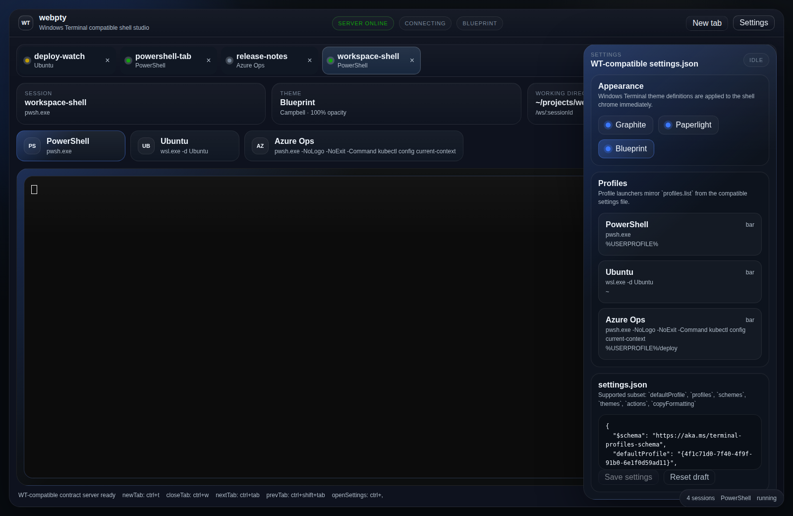

<div align="center">

# webpty

**브라우저용 심플한 Rust 기반 터미널 앱**

[English README](./README.md)

</div>

`webpty`는 Windows Terminal의 톤과 밀도를 참고해, 웹 환경에서 단순한
터미널 앱으로 시작하는 프로젝트입니다.

현재 프로토타입은 의도적으로 범위를 좁혔습니다.

- 큰 단일 터미널 영역
- 절제된 상단 chrome과 탭 스트립
- WT 호환 `settings.json` 스튜디오
- Rust HTTP/WebSocket 계약 서버

## 미리보기



## 현재 상태

현재 구현된 것:

- Windows Terminal 감성의 탭/프로필 런처/설정 스튜디오 셸
- 실시간 mock WebSocket 입출력을 가진 `xterm.js` 활성 터미널 뷰포트
- `config/webpty.settings.json` 기반 WT 호환 설정 파일 로드/저장
- 새 세션 / 세션 닫기 / 세션 순환 / 설정 열기 단축키
- health, settings, sessions, WebSocket transcript replay를 가진 Rust/Axum 서버

아직 없는 것:

- 실제 PTY 연결
- 탭 드래그/정렬
- split panes
- 검색, palette, command surface 수준의 기능 패리티

## 빠른 시작

### 요구사항

- Node.js 24+
- npm 11+
- Rust 1.94+

### 설치

```bash
npm install
```

### 프런트엔드 실행

```bash
npm run dev:web
```

### Rust 서버 실행

```bash
cargo run --manifest-path apps/server/Cargo.toml
```

서버는 호환 설정 subset을 `config/webpty.settings.json`에서 로드하고 다시 저장합니다.

## 검증

```bash
npm run lint:web
npm run build:web
cargo check --manifest-path apps/server/Cargo.toml
```

## 디렉터리 구조

```text
.
├── apps/
│   ├── server/   # Axum 계약 서버와 mock session transport
│   └── web/      # React/Vite 터미널 UI
├── docs/
│   ├── research-spec.md
│   ├── runtime-contracts.md
│   └── assets/
└── README.md
```

## 문서

- [Research spec](./docs/research-spec.md)
- [Runtime contracts](./docs/runtime-contracts.md)

## 로드맵

- [ ] mock transport를 PTY 세션 계층으로 교체
- [x] WebSocket을 통한 실시간 mock 셸 출력 연결
- [ ] 세션 상태 저장
- [x] WT 호환 settings studio와 테마 전환 추가
- [ ] panes, palette, search 같은 심화 Windows Terminal 기능 재도입

## 참고

- [microsoft/terminal](https://github.com/microsoft/terminal)

현재 앱은 Windows Terminal보다 훨씬 단순합니다. 지금 단계의 참고점은
기능 수보다 **터미널 앱다운 톤과 밀도**입니다.
