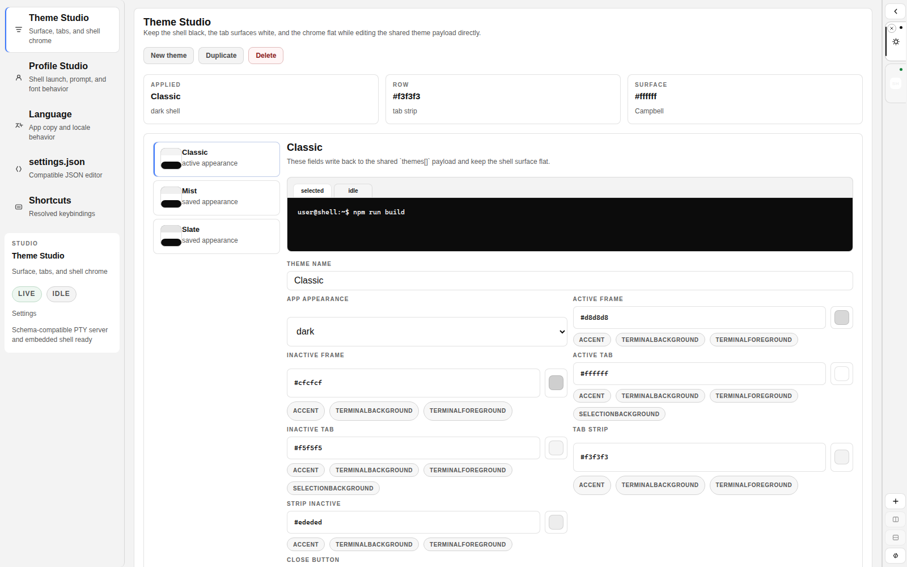
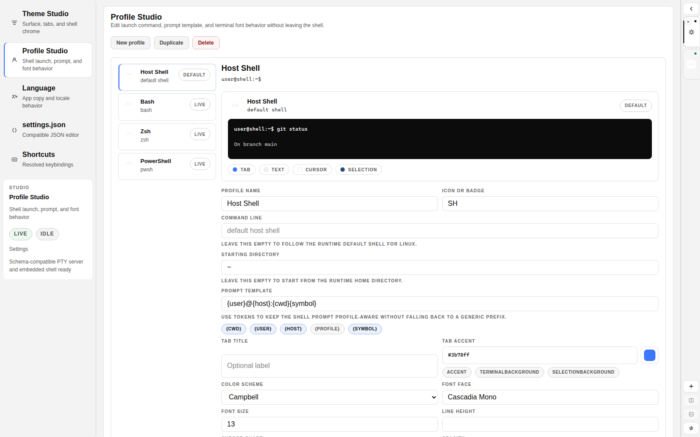
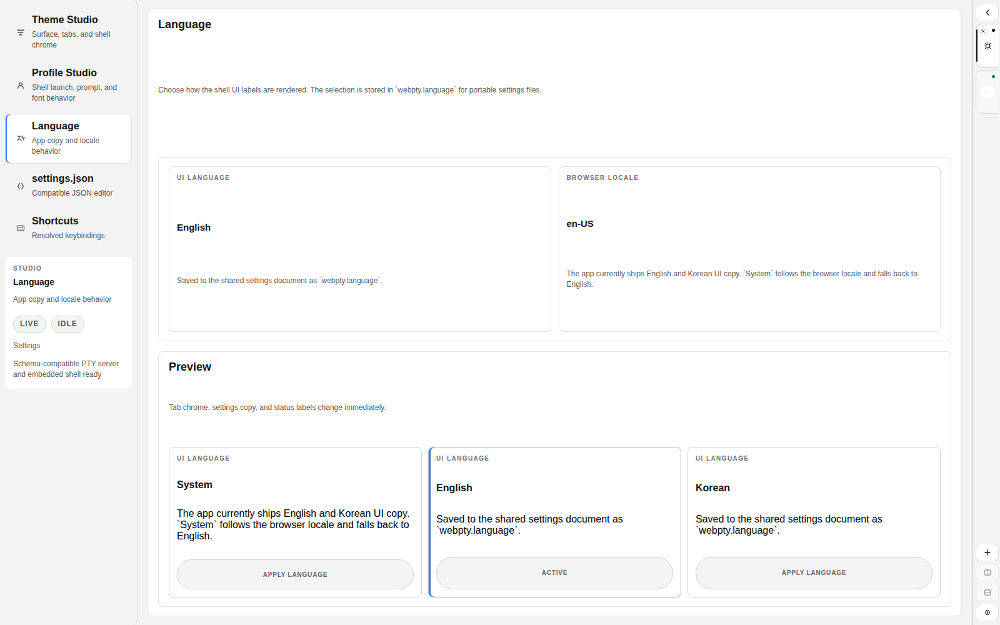
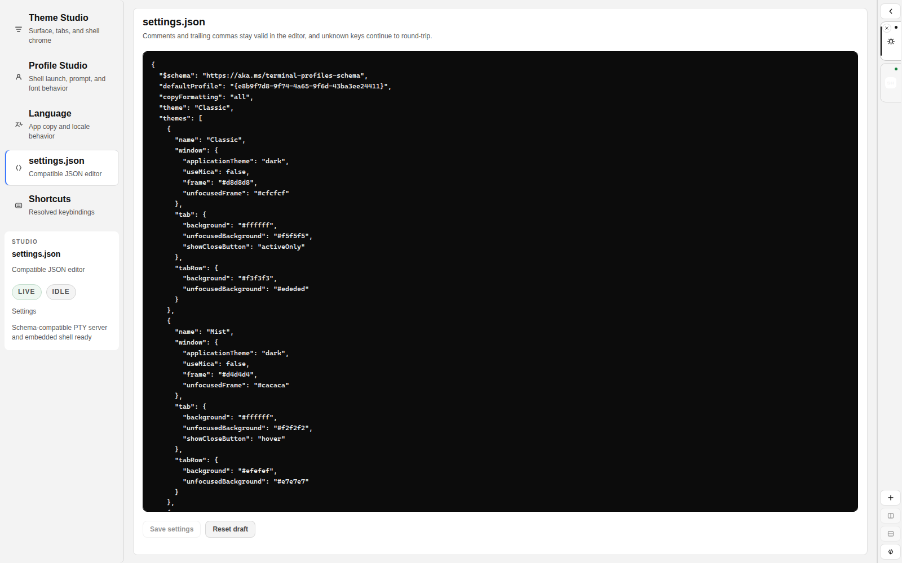
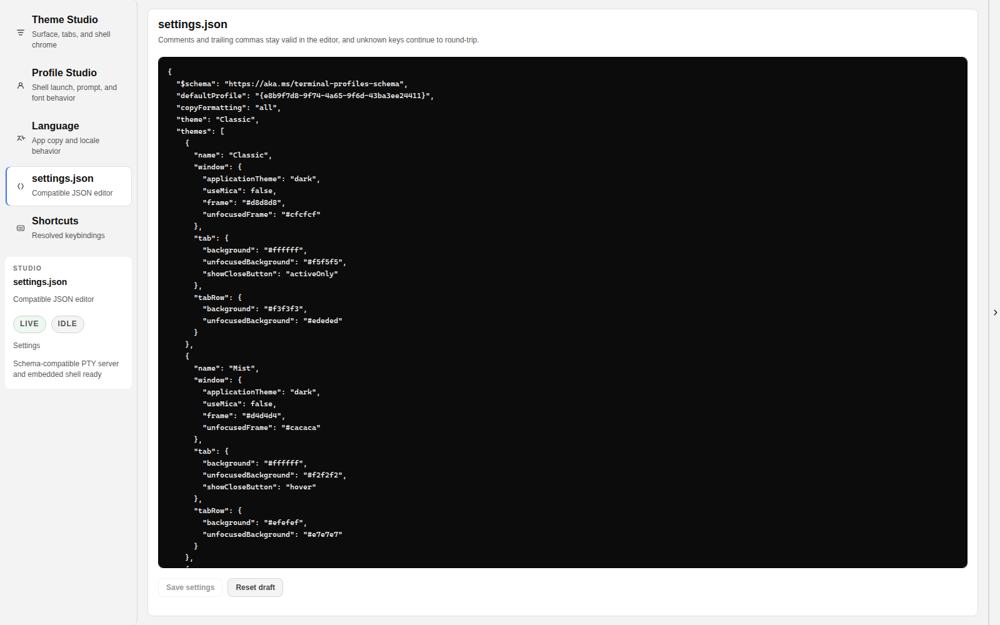

<div align="center">

# webpty

**Rust-backed browser terminal shell with shared profile and theme settings**

[](https://github.com/smturtle2/webpty/stargazers)
[](https://github.com/smturtle2/webpty/issues)
[](https://www.rust-lang.org/)
[](https://react.dev/)

[한국어 README](./README.ko.md)

</div>

`webpty` keeps the shell in control of the screen.
The terminal stays black and dominant, the session rail stays thin and bright
on the right edge, the settings workspace opens as its own rail tab, and the shipped
binary runs the UI and PTY runtime together with `webpty up`.

Profiles, themes, schemes, actions, and defaults use a shared desktop-terminal
`settings.json` shape. Unknown keys are preserved on save, and disk loading now
accepts JSONC-style comments and trailing commas.

## Preview












## Current Status

Implemented:

- live PTY-backed sessions from a Rust/Axum server
- embedded production UI served directly by the Rust binary
- `webpty up` CLI entrypoint for local startup
- `webpty up --funnel` external access through Tailscale Funnel
- automatic `tailscale up` bootstrap for `webpty up --funnel`, with login URL handoff when interactive auth is still required
- black terminal stage with no top toolbar
- narrow right-side rail with show/hide support
- tighter Windows 11-aligned rail density with white flat tab surfaces and a dedicated settings workspace tab
- dedicated Theme Studio for `themes[]`, `theme`, frame colors, and shell chrome editing
- dedicated Profile Studio for `profiles.list[]`, default profile, prompt, font, and shell field editing
- dedicated Language section backed by `webpty.language` for English / Korean / system-following UI copy
- stable Theme Studio / Profile Studio draft syncing with no recursive render-loop console errors
- in-app create / duplicate / delete flows for profile and theme entries
- in-app color pickers for tab, frame, shell, cursor, and selection colors
- full color value editing in Theme Studio and Profile Studio so hex fields stay readable instead of collapsing to a clipped prefix
- token shortcut chips for shared theme color values such as `accent` and `terminalBackground`
- live profile preview surface for prompt, tab accent, and shell color verification
- optional `webpty.prompt` templates with `{cwd}`, `{user}`, `{host}`, `{profile}`, and `{symbol}` tokens
- launchable startup-profile guards so hidden profiles cannot become the default shell accidentally
- schema-compatible `settings.json` loading, normalization, persistence, and unknown-key round-trip preservation
- JSONC-style settings file loading on disk
- JSONC-style editing in the in-app `settings.json` panel
- string and object-form action bindings such as `{ "command": { "action": "newTab" } }`
- runtime-matched profile prompt previews in Profile Studio and theme previews
- literal prompt-template spacing preserved in Theme Studio and Profile Studio previews
- prompt-template previews now sanitize `{profile}` with the same rules as the runtime shell path
- per-profile prompt shaping on non-Windows shell launches and fallbacks so sessions do not collapse to `bash-5.2$`
- default zsh host launches now use a clean interactive path so macOS-style defaults do not override profile-shaped prompts immediately
- host-scoped default settings generation so first-run profiles follow the runtime OS instead of shipping Windows-only launch commands everywhere
- host-native default settings paths, including `~/Library/Application Support/webpty/settings.json` on macOS
- runtime host metadata now feeds host-aware command and directory hints inside Profile Studio
- user-scoped settings now win by default, while the repo sample stays opt-in through `--settings`
- sanitized session previews so control sequences such as bracketed-paste markers do not leak into summaries
- real viewport application for `padding`, explicit `lineHeight`, and `window.useMica`
- repeated terminal fit passes so narrow and mobile viewports stop rendering xterm rows off-canvas
- stricter launch cwd validation so file paths do not become session working directories
- safer Funnel cleanup and broader capability detection during startup and shutdown
- vertical and horizontal split creation inside the active tab
- subtler split-pane separators and active-pane framing without floating badge overlays
- WebSocket input/output streaming and PTY resize handling
- browser-safe profile icon sources rendered in the rail and settings workspace
- embedded UI rebuild tracking so Rust picks up fresh bundled assets after frontend builds
- icon-first right rail with safe collapsed bounds, tighter density, and broader text-overflow protection
- reproducible screenshot refresh through `npm run docs:shots`
- refreshed repository screenshots captured from the sample settings catalog for stable docs output

Known gaps:

- deeper pane graphs, drag rearranging, and persisted pane layouts
- drag/drop tab ordering
- broader action object coverage beyond the current tab/settings subset
- host-local icon URI parity for every profile asset format
- session restoration across app restarts

## Quick Start

### Requirements

- Rust 1.94+
- Node.js 24+ and npm 11+ only when rebuilding the frontend bundle or working on the UI

### Global Install

```bash
cargo install --git https://github.com/smturtle2/webpty --bin webpty --locked
```

If `webpty` is not found after install, add Cargo's bin directory to `PATH`
(`$HOME/.cargo/bin` on Linux/macOS).

Local checkout install:

```bash
cargo install --path apps/server --bin webpty --locked
```

### Run

```bash
webpty up
```

The local shell opens at `http://127.0.0.1:3001` by default.

Run with the repository sample settings:

```bash
webpty up --settings ./config/webpty.settings.json
```

`./config/webpty.settings.json` is a fixed demo catalog for screenshots and
manual QA. Installed first-run defaults still come from the runtime host.

### External Access

```bash
webpty up --funnel
```

`--funnel` uses the local `tailscale` CLI to publish the embedded web UI. If the
local client is offline, `webpty` first attempts `tailscale up` automatically
before allocating Funnel. For headless bootstrap flows, `webpty` also honors
`WEBPTY_TAILSCALE_AUTH_KEY`, `TS_AUTHKEY`, and `TS_AUTH_KEY`.
If interactive login is still required, `webpty` prints the Tailscale auth URL
and exits cleanly. Treat Funnel as public exposure of the shell surface and only
use it behind a trusted machine and network policy.
Keep `--host` on loopback or all interfaces when using `--funnel`.

## Settings Path

Resolution order:

1. `webpty up --settings <path>`
2. `WEBPTY_SETTINGS_PATH=<path>`
3. user-scoped platform path

The repository sample settings file stays opt-in through:

```bash
webpty up --settings ./config/webpty.settings.json
```

User-scoped platform path:

- Linux: `~/.config/webpty/settings.json`
- macOS: `~/Library/Application Support/webpty/settings.json`
- Windows: `%APPDATA%\\webpty\\settings.json`

If the file does not exist, `webpty` creates a default one.
If an existing file is invalid, startup fails without overwriting it.
The generated default profile catalog follows the runtime host:

- Windows: PowerShell-first with additional WSL-oriented profiles
- Linux/macOS: local shell-first profiles derived from the host environment

## Development

Install workspace dependencies:

```bash
npm install
```

Run the frontend dev server:

```bash
npm run dev:web
```

Run the Rust runtime:

```bash
cargo run -- up
```

The Vite dev server proxies `/api` and `/ws` to `http://127.0.0.1:3001`, while
production builds are emitted into `apps/server/ui` and served by the Rust
binary. The Rust build watches `apps/server/ui`, so a fresh backend build
re-embeds updated frontend assets automatically.

## Validate

```bash
npm run build:web
cargo test --manifest-path apps/server/Cargo.toml
cargo check
npm run docs:shots
```

## Ship Changes

```bash
git status --short
npm run build:web
cargo test --manifest-path apps/server/Cargo.toml
git add -A
git commit -m "Refine shell runtime and settings studio"
git push origin main
```

## Architecture

```text
React shell
  ├─ terminal stage
  ├─ right-side session rail
  └─ settings workspace tab
       ↓
Rust runtime
  ├─ embedded asset serving
  ├─ settings load/save
  ├─ PTY session lifecycle
  ├─ input / resize / output streaming
  ├─ session creation and deletion
  └─ optional Tailscale Funnel
```

## Documentation

- [Implementation audit](./docs/implementation-audit.md)
- [Compatibility notes](./docs/compatibility.md)
- [Research spec](./docs/research-spec.md)
- [Runtime contracts](./docs/runtime-contracts.md)
